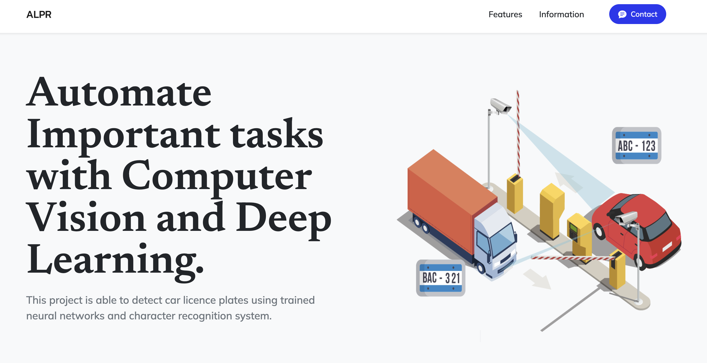
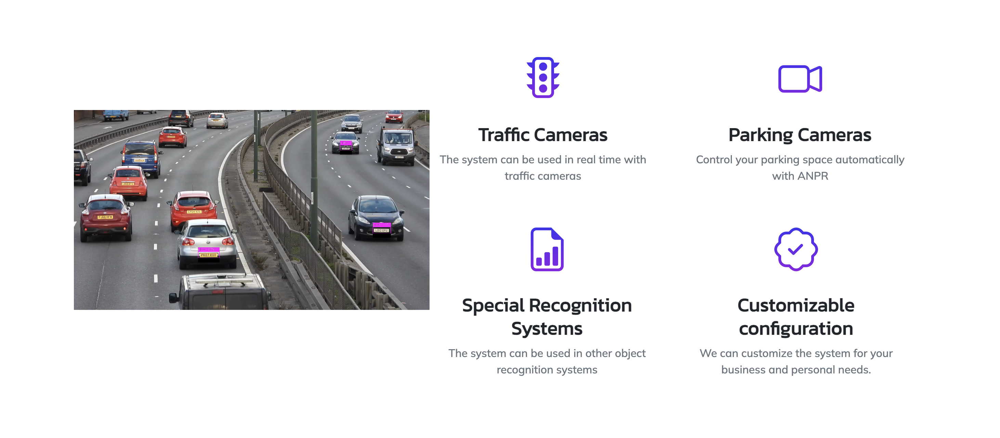
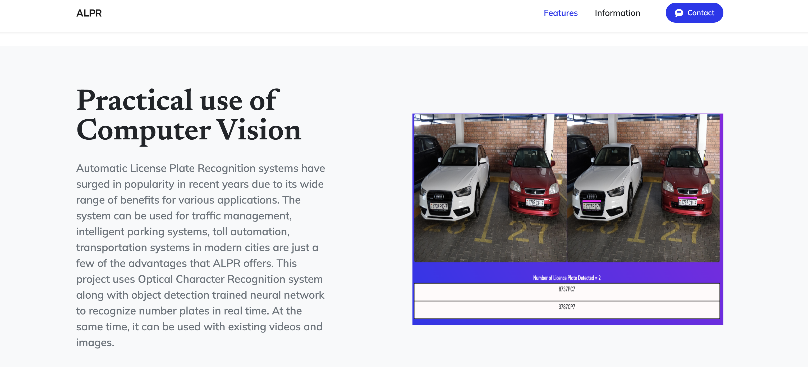

# Automatic License Plate Recognition
This project is a capstone project created by Sardorbek Zokirov using Neural Networks and Computer Vision to create an Automatic License Plate Recognition System. 
## Table of contents
* [General Info](#general-info)
* [Technologies](#technologies)
* [Setup](#setup)

## General Info
I have created an Automatic License Plate Recognition using two different neural networks in order to detect the number plate of a car and then read the number plate from the cropped image. The data is then stored in a SQLlite database using CSV file. The application runs on Flask web app. 



## Technologies
Project is created with:
* Python
* PyTorch
* OpenCV
* Pandas
* YOLOv5
* HTML/CSS
* JavaScript
* Pytesseract


## Setup
To run the project, run the following command on terminal:
```python app.py``
And open the localhost on your PC. 
You can run the install the requirements.txt file in order to install all dependencies and packages needed to run the application. 



## Conclusions
The project was created from scratch by me in order to understand the usage of Neural Networks and expand my knowledge on the subject. I have used the YOLOv5 Neural network since it offers great performance in real time. 